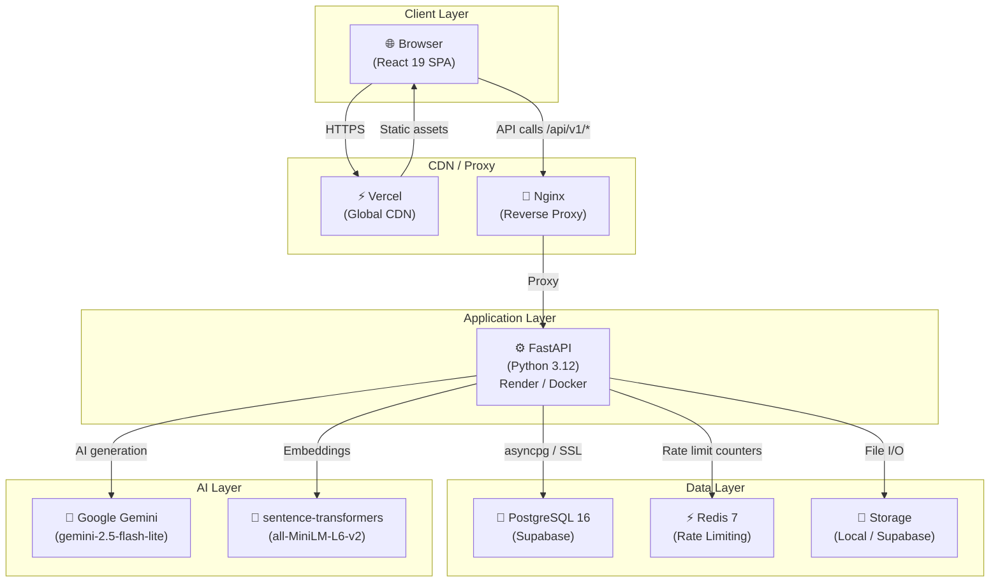
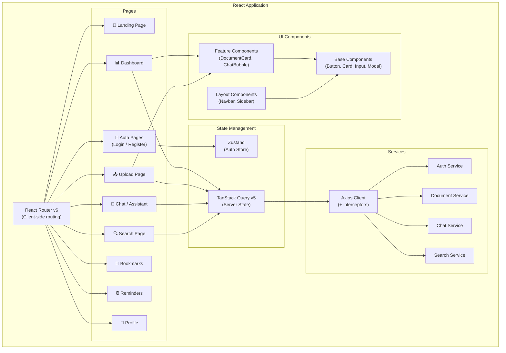
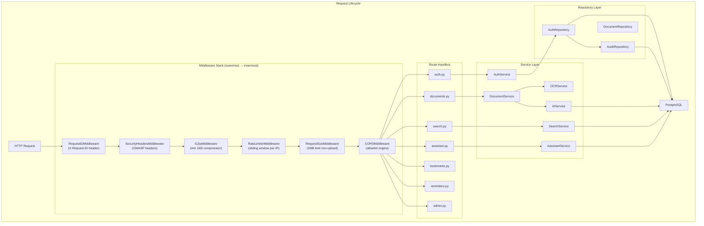
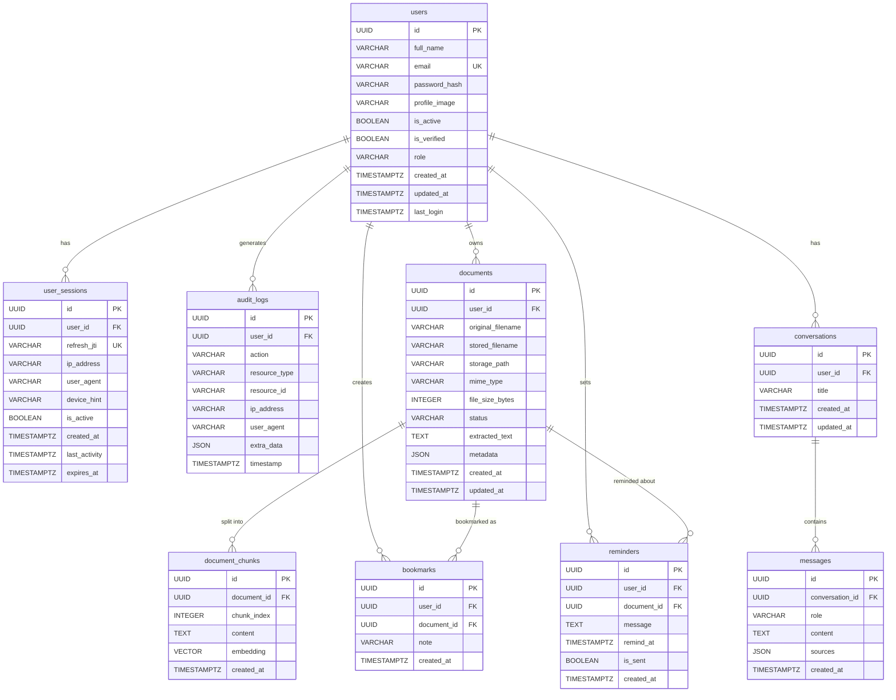
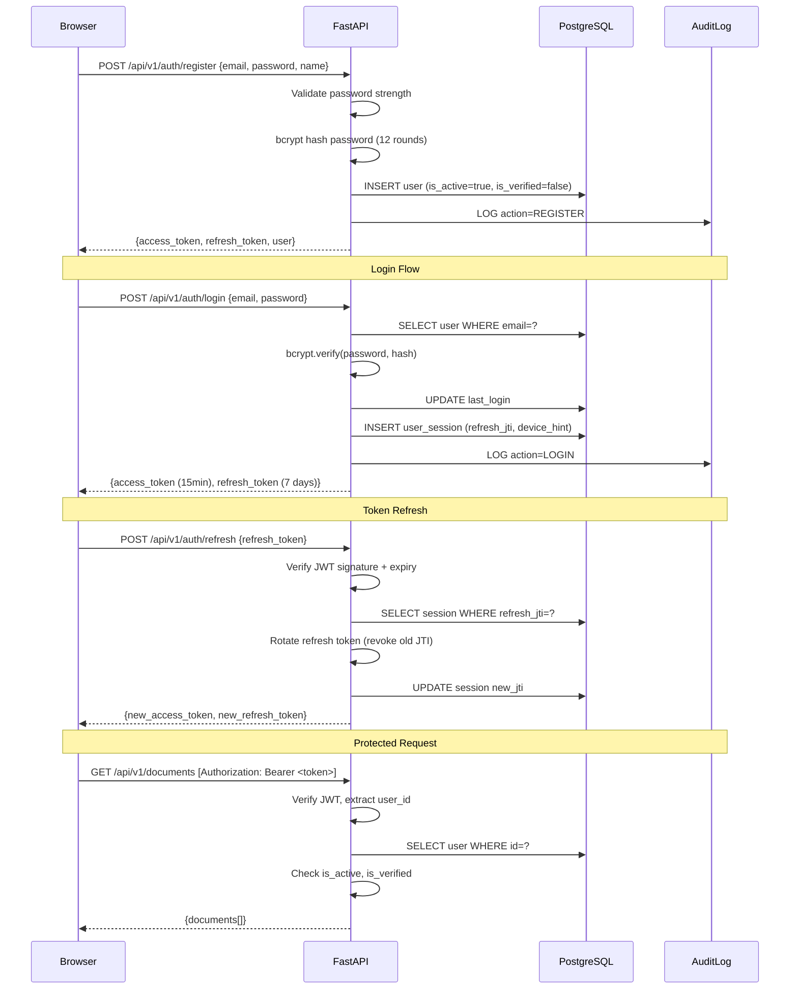
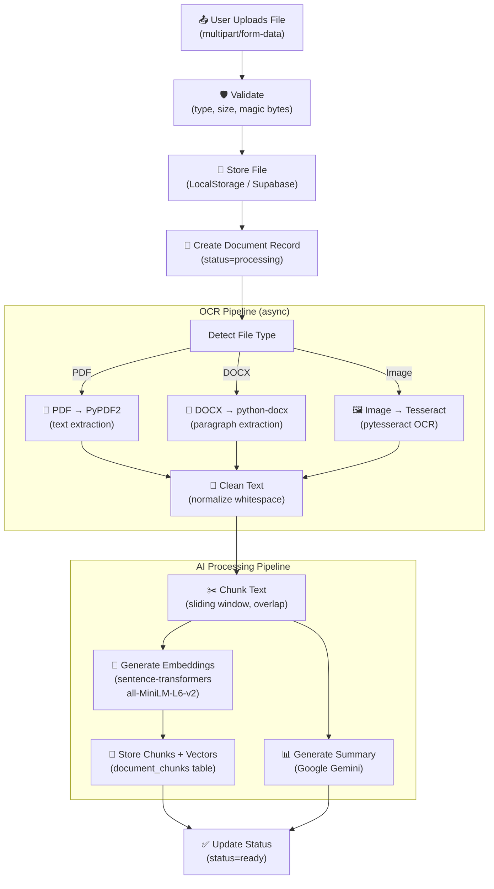
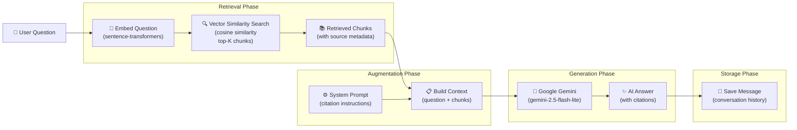
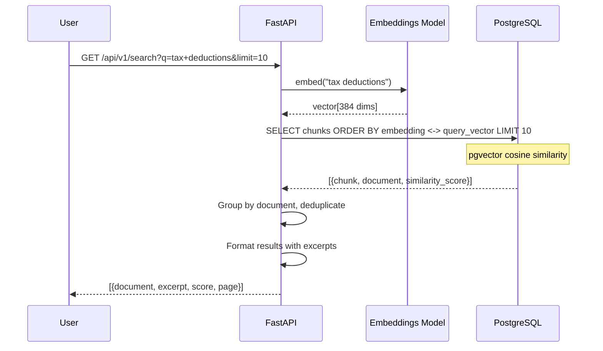
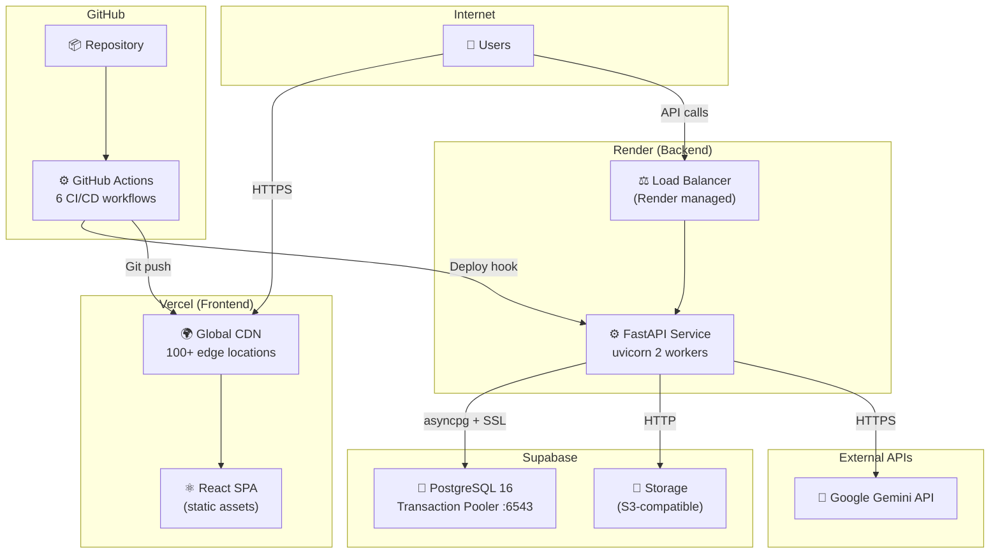
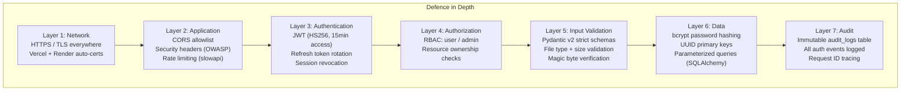

# DocuMind AI — System Architecture

> Complete architectural reference for the DocuMind AI platform (v1.0.0)

---

## Table of Contents

1. [Overview](#overview)
2. [System Architecture](#system-architecture)
3. [Frontend Architecture](#frontend-architecture)
4. [Backend Architecture](#backend-architecture)
5. [Database Schema (ER Diagram)](#database-schema)
6. [Authentication Flow](#authentication-flow)
7. [Document Processing Pipeline](#document-processing-pipeline)
8. [AI Processing Pipeline](#ai-processing-pipeline)
9. [Semantic Search Flow](#semantic-search-flow)
10. [Deployment Architecture](#deployment-architecture)
11. [Security Architecture](#security-architecture)
12. [Middleware Stack](#middleware-stack)

---

## Overview

DocuMind AI is a full-stack SaaS platform for AI-powered document analysis. Users upload documents (PDF, DOCX, images), which are processed through an OCR and embedding pipeline. They can then query their document library in natural language and receive AI-generated answers with source citations.

**Tech Stack Summary:**

| Layer | Technology |
|---|---|
| Frontend | React 19, TypeScript, Vite, Tailwind CSS |
| Backend | FastAPI, Python 3.12, Uvicorn |
| Database | PostgreSQL 16, SQLAlchemy 2.x async |
| AI | Google Gemini (gemini-2.5-flash-lite) |
| Embeddings | sentence-transformers |
| OCR | Tesseract, PyPDF2, python-docx |
| Cache | Redis 7 |
| Storage | Local / Supabase Storage |
| Proxy | Nginx |
| CI/CD | GitHub Actions (6 workflows) |
| Hosting | Vercel + Render + Supabase |

---

## System Architecture



---

## Frontend Architecture



### Key Frontend Patterns

| Pattern | Implementation |
|---|---|
| Auth state | Zustand store persisted to localStorage |
| Server state | TanStack Query with stale-while-revalidate |
| API client | Axios with request/response interceptors |
| Protected routes | HOC checks Zustand auth store |
| Token refresh | Axios interceptor retries 401s with refresh token |
| Forms | React controlled components + Pydantic-aligned validation |

---

## Backend Architecture



### Layer Responsibilities

| Layer | Responsibility | Pattern |
|---|---|---|
| **Routes** | HTTP request/response, schema validation | FastAPI dependencies |
| **Services** | Business logic, orchestration | Plain async classes |
| **Repositories** | Database queries, no business logic | Repository pattern |
| **Models** | ORM entity definitions | SQLAlchemy 2.x mapped_column |
| **Schemas** | Request/response validation | Pydantic v2 BaseModel |

---

## Database Schema



---

## Authentication Flow



---

## Document Processing Pipeline



---

## AI Processing Pipeline (RAG)



---

## Semantic Search Flow



---

## Deployment Architecture



---

## Security Architecture



---

## Middleware Stack

Middleware is applied in LIFO order (last added = outermost = first to execute):

```
Incoming Request
      │
      ▼
┌─────────────────────────────────────┐
│  1. RequestIDMiddleware             │  Adds X-Request-ID header
│     (outermost)                     │  All logs tagged with request ID
├─────────────────────────────────────┤
│  2. SecurityHeadersMiddleware       │  X-Frame-Options: DENY
│                                     │  X-Content-Type-Options: nosniff
│                                     │  Referrer-Policy: strict-origin
├─────────────────────────────────────┤
│  3. GZipMiddleware                  │  Compress responses > 1KB
├─────────────────────────────────────┤
│  4. RateLimiterMiddleware           │  Global: 200/min per IP
│                                     │  Auth: 10/min
│                                     │  Upload: 20/min, Chat: 30/min
├─────────────────────────────────────┤
│  5. RequestSizeMiddleware           │  Reject non-upload requests > 1MB
├─────────────────────────────────────┤
│  6. CORSMiddleware                  │  Allowlist only configured origins
│     (innermost)                     │  Handles OPTIONS preflight
└─────────────────────────────────────┘
      │
      ▼
 Route Handlers → Services → Repositories → Database
```
